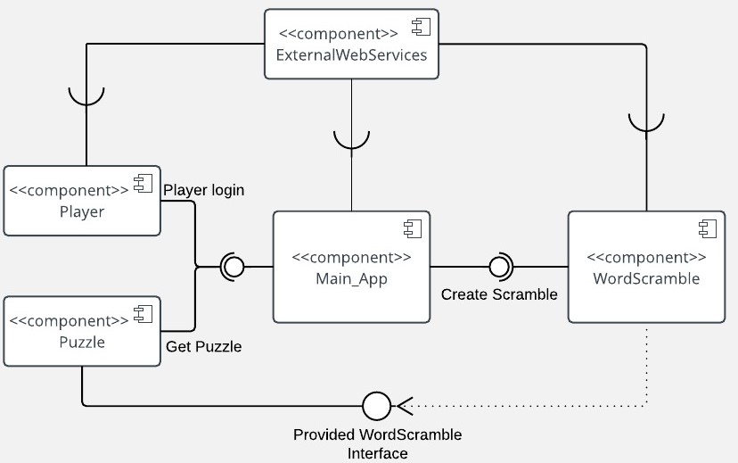
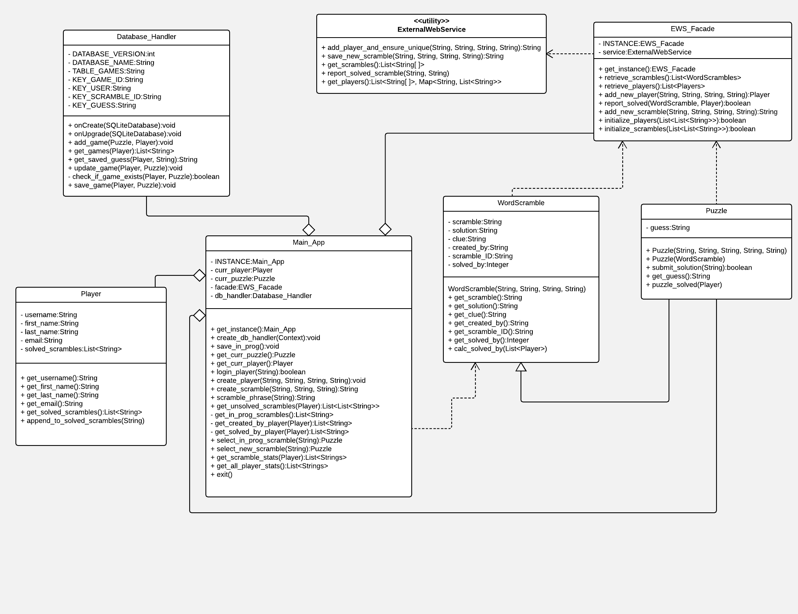
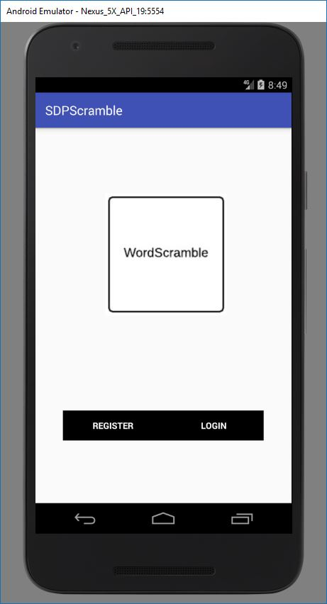
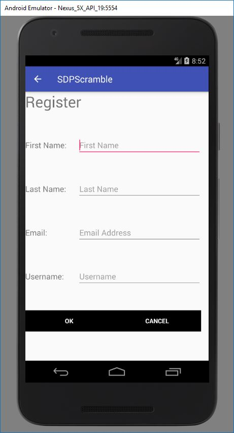
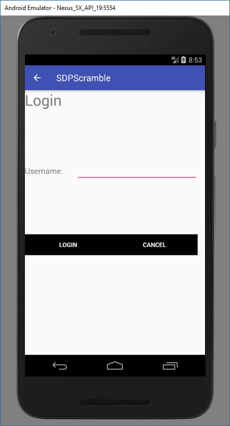
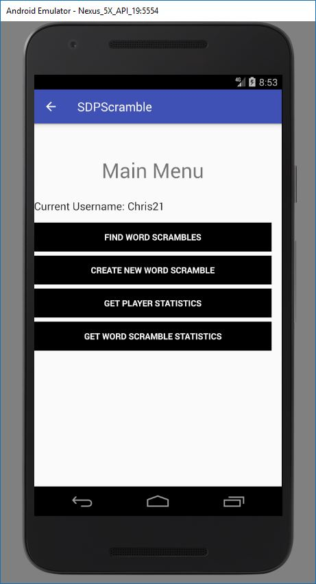
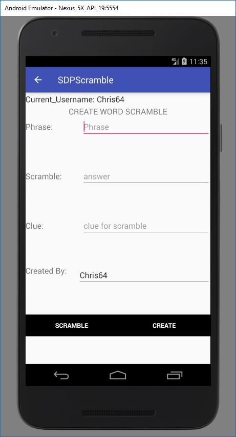
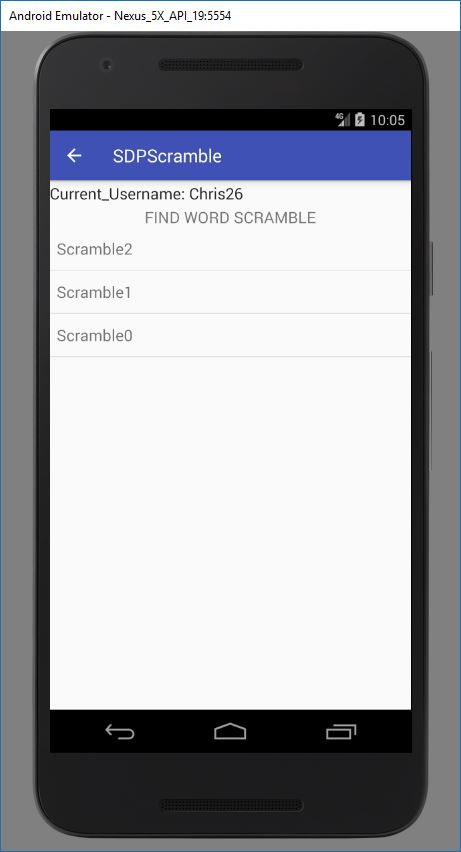

# Design Document

**Author**: Team80

## 1 Design Considerations

### 1.1 Assumptions

The product will be delivered as Android App. User can download and install the app on their andorid devices. The App is going to be run through internet. The user and scramble will be stored in ExternalWebServices(EWS). The Main_App class will interact with ExternalWebServices to retrieve the User and WordScramble statistics information. All users will access the Main_App from EWS. 

### 1.2 Constraints

The storage format of User and WordScramble in EWS. The user has to register an account, create an WordScramble, or retireve WordScramble from EWS.

### 1.3 System Environment

System Environment:
1. Java 1.8
2. Device with Android 4.4+ 
3. ExternalWebServices

## 2 Architectural Design

### 2.1 Component Diagram  

### 2.2 Deployment Diagram
The app deployment will be simply for Android 4.4+ systems, we do not need deployment diagram to deploy or interact in other systems.

## 3 Low-Level Design

### 3.1 Class Diagram

### 3.2 Other Diagrams

## 4 User Interface Design
The user interface will be a touch-enabled GUI interface. It will be a drawer navigation (“Main Menu”) with each main menu (Create New Player, LogIn) as a group of activities. When New Player is selected, a interface of new player will be prompted. Upon LogIn, a drawer navigation with New Scramble, In-progress Scramble, User Statistics will be shown for user selection. During interacting with EWS, an progress bar can be shown during infomation retrieval from EWS.

1. Home Page  

2. Register  

3. Login  

4. Main Menu  

5. Create Scramble  

6. Find Word Scrambles  

